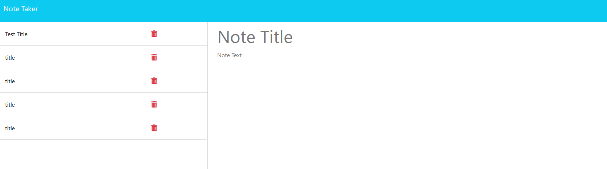

# <Note-Taker>

## Description

The goal of the application was to create a backend via Express.js for a note taking app. The front end was provided as starter code, so this was an excellent chance to practice creating a back end that links to an existing front end. I created routes for /notes.html, a wildcard that sends you to the index.html, as well as /API/notes GET and POST.

## Installation

N/A

## Usage

You may view the deployed application [here](https://intense-tundra-61951-bbb3cb2d4877.herokuapp.com/).

## Credits

This project was done as part of the KU Fullstack Bootcamp; the front end code was provided by them.

## License

Please see license in GitHub repository